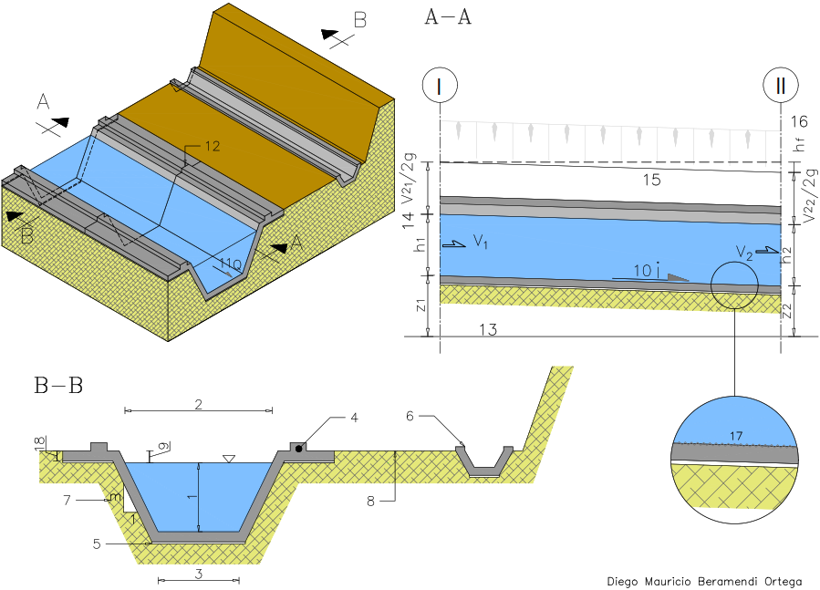

# Channels

Written by Diego Beramendi Ortega  
Stuttgart, 03.06.2022

<table>
    <tr style="background-color: dimgrey">
        <td><b>N°</b></td>
        <td><b>Spanish</b></td>
        <td><b>English</b></td>
        <td><b>German</b> </td>
    </tr>
    <tr>
        <td><b>1</b></td>
        <td>Tirante de agua</td>
        <td>Waterhead</td>
        <td>Wassertiefe(f)</td>
    </tr>
    <tr style="background-color: rgba(95,158,160,0.46)">
        <td><b>2</b></td>
        <td>Espejo de agua</td>
        <td>Water-mirror</td>
        <td>Wasserspiegel(m) (DIN 4044)</td>
    </tr>
    <tr>
        <td><b>3</b></td>
        <td>Base </td>
        <td>Base </td>
        <td>Breite(f)</td>
    </tr>
    <tr style="background-color: rgba(95,158,160,0.46)">
        <td><b>4</b></td>
        <td>Concreto </td>
        <td>Beton</td>
        <td>Beton(m)</td>
    </tr>
    <tr>
        <td><b>5</b></td>
        <td>Hormigón pobre</td>
        <td>Lean Concrete, Blindinglayer</td>
        <td>Margerbeton(m), Sauberkeitsschicht(f)</td>
    </tr>
    <tr style="background-color: rgba(95,158,160,0.46)">
        <td><b>6</b></td>
        <td>Cuneta de drenaje</td>
        <td>Drainage ditch </td>
        <td>Brängraben(m), Entwässerungsgraben(m)</td>
    </tr>
    <tr>
        <td><b>7</b></td>
        <td>Talud</td>
        <td>Side slope</td>
        <td>Böschung(f)</td>
    </tr>
    <tr style="background-color: rgba(95,158,160,0.46)">
        <td><b>8</b></td>
        <td>Camino de acceso</td>
        <td>Access road</td>
        <td>Zufahrtsstraße(f)</td>
    </tr>
    <tr>
        <td><b>9</b></td>
        <td>Bordo libre</td>
        <td>Freeboard</td>
        <td>Freibord(n)</td>
    </tr>
    <tr style="background-color: rgba(95,158,160,0.46)">
        <td><b>10</b></td>
        <td>Pendiente</td>
        <td>Slope</td>
        <td>Sohlgefählle(n)</td>
    </tr>
    <tr>
        <td><b>11</b></td>
        <td>Caudal</td>
        <td>Flow rate</td>
        <td>Abfluss(m)</td>
    </tr>
    <tr style="background-color: rgba(95,158,160,0.46)">
        <td><b>12</b></td>
        <td>Junta de dilatación</td>
        <td>Expansion joint</td>
        <td>Dehnungsfuge(f)</td>
    </tr>
    <tr>
        <td><b>13</b></td>
        <td>Plano de referencia</td>
        <td>Datum </td>
        <td>Bezugshorizont(m)</td>
    </tr>
    <tr style="background-color: rgba(95,158,160,0.46)">
        <td><b>14</b></td>
        <td>Altura de velocidad</td>
        <td>Velocity head</td>
        <td>Geschwindigkeitshöhe(f)</td>
    </tr>
    <tr>
        <td><b>15</b></td>
        <td>Línea de Energía</td>
        <td>Eneryline</td>
        <td>Energielinie(f)</td>
    </tr>
    <tr style="background-color: rgba(95,158,160,0.46)">
        <td><b>16</b></td>
        <td>Perdida de energia</td>
        <td>Energy loss</td>
        <td>Energieverlust(f)</td>
    </tr>
    <tr>
        <td><b>17</b></td>
        <td>Rugosidad</td>
        <td>Roughness</td>
        <td>Abflussrauhheit(f)</td>
    </tr>
    <tr style="background-color: rgba(95,158,160,0.46)">
        <td><b>18</b></td>
        <td>Espesor</td>
        <td>Thickness</td>
        <td>Dicke(f)</td>
    </tr>
    <tr>
        <td><b>-</b></td>
        <td>Corte Transversal  B-B</td>
        <td>Cross section B-B</td>
        <td>Querschnitt(m) B-B</td>
    </tr>
    <tr style="background-color: rgba(95,158,160,0.46)">
        <td><b>-</b></td>
        <td>Corte Longitudnal A-A</td>
        <td>Longitudinal section A-A</td>
        <td>Längsschnitt(m)A-A</td>
    </tr>
</table>

Item 17 is referred in English as `Coefficient of Roughness` which its equivalent in German would also be
`Rauhigkeitsbeiwert (m)`or `Rauheitskenngröße(f)`

