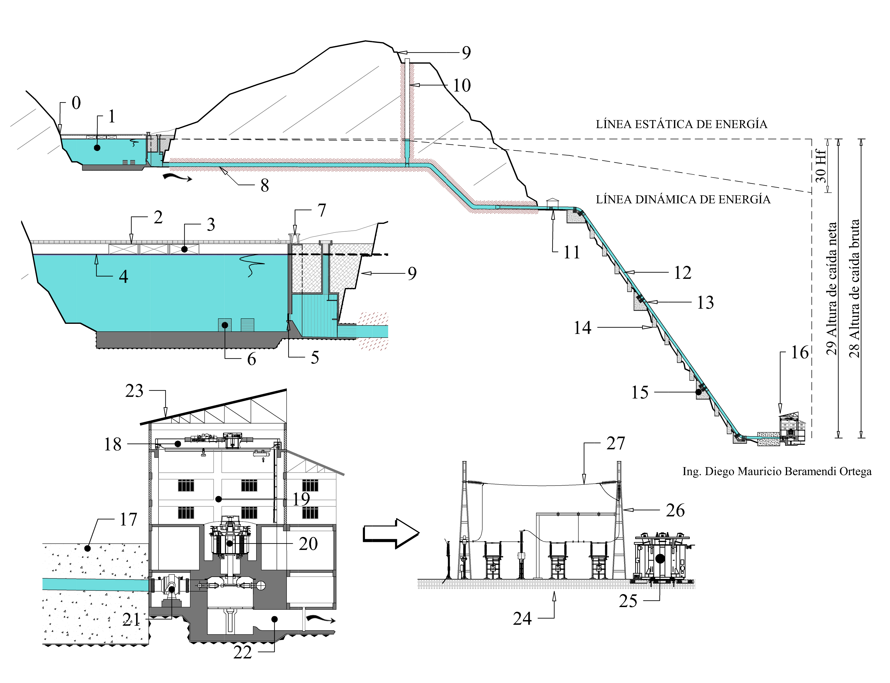

# Hydropower Projects 

## Components 

Written by Diego Beramendi Ortega  
Stuttgart, 29.05.2022

The following figure illustrates in a general way the components of a hydropower project arrangement:

**Fig.1** - Components of a hydropower project. Source: Beramendi, 2022.

Table 1 indicates the name of each component of Figure 1 in Spanish, English and German. 
The subscript letter in the german words indicate the gender of each word (**m**: masculine [der], **f**:femenine [die], **n**:neutro [n]).
<table>
    <tr style="background-color: dimgrey">
        <td><b>N°</b></td>
        <td><b>Spanish</b></td>
        <td><b>English</b></td>
        <td><b>German</b> </td>
        <td><b>N°</b></td>
        <td><b>Spanish</b></td>
        <td><b>English</b></td>
        <td><b>German</b></td>
    </tr>
    <tr>
        <td><b>0</b></td>
        <td>Estribo</td>
        <td>Abutment</td>
        <td>Wiederlager(n)</td>
        <td><b>16</b></td>
        <td>Casa de máquinas</td>
        <td>Power house, Power plant</td>
        <td>Maschinenhaus (n)</td>
    </tr>
    <tr style="background-color: rgba(95,158,160,0.46)">
        <td><b>1</b></td>
        <td>Embalse</td>
        <td>Water-reservoir</td>
        <td>Wasserspeicher (m)</td>
        <td><b>17</b></td>
        <td>Bifurcador o trifurcador* (depends on the project)</td>
        <td>Bifurcator or Trifurcator</td>
        <td>Hosenrohr(n) (DIN4048), Hosenstück(n)</td>
    </tr>
    <tr>
        <td>2</td>
        <td>Cresta de la Presa</td>
        <td>Dam-crest</td>
        <td>Dammkrone (f) </td>
        <td><b>18</b></td>
        <td>Puente grua</td>
        <td>Travelling crane</td>
        <td>Laufkran (m)</td>
    </tr>
    <tr style="background-color: rgba(95,158,160,0.46)">
        <td><b>3</b></td>
        <td>Vertedero</td>
        <td>Spillway</td>
        <td>Überfall (m)</td>
        <td><b>19</b></td>
        <td>Sala de máquinas</td>
        <td>Machine hall</td>
        <td>Maschinenhaus(n)</td>
    </tr>
    <tr>
        <td><b>4</b></td>
        <td>Nivel Máximo de Operación</td>
        <td>Head race Headwater Level</td>
        <td>Oberwasserniveau(m) </td>
        <td><b>20</b></td>
        <td>Generador</td>
        <td>Generator</td>
        <td>Generator(m)</td>
    </tr>
    <tr style="background-color: rgba(95,158,160,0.46)">
        <td><b>5</b></td>
        <td>Obra de toma</td>
        <td>Intake, Inlet</td>
        <td>Wasserfassung(f), Einlass(m)</td>
        <td><b>21</b></td>
        <td>Válvula</td>
        <td>Valve</td>
        <td>Kugelschieber(m)</td>
    </tr>
    <tr>
        <td><b>6</b></td>
        <td>Descarga de fondo</td>
        <td>Oulet</td>
        <td>Auslass(m), Ablauf(m)</td>
        <td><b>22</b></td>
        <td>Canal de fuga</td>
        <td>Tailrace channel, Discharge channel</td>
        <td>Unterwasserkanal(n)</td>
    </tr>
    <tr style="background-color: rgba(95,158,160,0.46)">
        <td><b>7</b></td>
        <td>Grua de pórtico Pórtico de isaje de compuerta</td>
        <td>Gantry crane</td>
        <td>Portalkran(m)</td>
        <td><b>23</b></td>
        <td>Cubierta</td>
        <td>Roof</td>
        <td>Bedachung(f)</td>
    </tr>
    <tr>
        <td><b>8</b></td>
        <td>Túnel de conducción, Túnel de presión</td>
        <td>Headrace tunnel, Pressure tunnel, Diversion tunnel</td>
        <td>Druckstullen(m)</td>
        <td><b>24</b></td>
        <td>Subestación</td>
        <td>Substation, Switch yard</td>
        <td>Unterwerk(m)</td>
    </tr>
    <tr style="background-color: rgba(95,158,160,0.46)">
        <td><b>9</b></td>
        <td>Talud</td>
        <td>Slope</td>
        <td>Böschung(f)</td>
        <td><b>25</b></td>
        <td>Transformador</td>
        <td>Transformer</td>
        <td>Trasnformator(m)</td>
    </tr>
    <tr>
        <td><b>10</b></td>
        <td>Chimenea de Equilibrio</td>
        <td>Surge tank, Surge shaft</td>
        <td>Wasserschloss(n)</td>
        <td><b>26</b></td>
        <td>Torre de alta tensión</td>
        <td>Transmission tower</td>
        <td>Getriebeturm(m)</td>
    </tr>
    <tr style="background-color: rgba(95,158,160,0.46)">
        <td><b>11</b></td>
        <td>Cámara de Válvulas</td>
        <td>Valve chamber</td>
        <td>Schieberkammer(f)</td>
        <td><b>27</b></td>
        <td>Línea de transmisión</td>
        <td>Overhead transmission line, Powerline </td>
        <td>Stromnetz(n), übertragung(f)</td>
    </tr>
    <tr>
        <td><b>12</b></td>
        <td>Tubería de presión</td>
        <td>Pressure shaft, Penstock</td>
        <td>Druckrohrleitung(f)</td>
        <td><b>28</b></td>
        <td>Altura bruta</td>
        <td>Gross head</td>
        <td>Bruttofallhöhe(f)</td>
    </tr>
    <tr style="background-color: rgba(95,158,160,0.46)">
        <td><b>13</b></td>
        <td>Junta de la Tubería</td>
        <td>Pipe Joint</td>
        <td>Rohrverbindung(f)</td>
        <td><b>29</b></td>
        <td>Altura neta</td>
        <td>Net head</td>
        <td>Nettofallhöhe(f)</td>
    </tr>
    <tr>
        <td><b>14</b></td>
        <td>Apoyos</td>
        <td>Support piers, Side  blocks, Buttress piers</td>
        <td>Tragpfeiler(m)</td>
        <td><b>30</b></td>
        <td>Perdida de carga</td>
        <td>Loss head</td>
        <td>Druckverlust(m)</td>
    </tr>
    <tr style="background-color: rgba(95,158,160,0.46)">
        <td><b>15</b></td>
        <td>Ancla</td>
        <td>Anchor block, Support block</td>
        <td>Verankerungsblöcke(m)</td>
        <td>-</td>
        <td>-</td>
        <td>-</td>
        <td>-</td>
    </tr>
</table>

